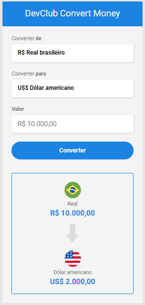

# Conversor de moedas

Criação de um conversor de moedas, onde foram adicionadas as moedas Real brasileiro, Dólar americano, Yen e Bitcoin.
Neste projeto foram utilizadas as tecnologias HTML, CSS e JavaScript e consome uma API de conversor de moedas onde mostras
em tempo real cada cotação com o valor atual.

> Resultados do projeto:

## 🛠 Ferramentas utilizadas:

## 💻 Tecnologias utilizadas:

## O que foi desenvolvido:

- [x] Conversor de moeda responsivo
- [x] Adicionado a moeda JPY(yen japonês)
- [x] Consumo de API de cotações de moedas em tempo real
- [ ] Adicionar mais cotações
- [ ] Corrigir erro na cotação do BitCoin

## 👦🏼 Pessoas envolvidas no projeto:

<table>
  <tr>
    <td align="center">
      <a href="https://github.com/gGtEriKk">
         
          
            <b>Erik Gomes</b>
          
      </a>
</table>
